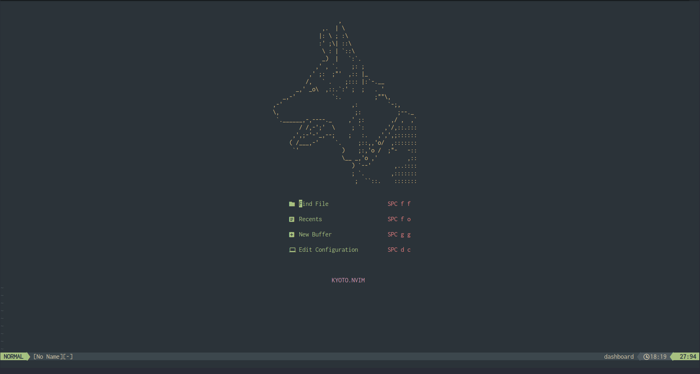
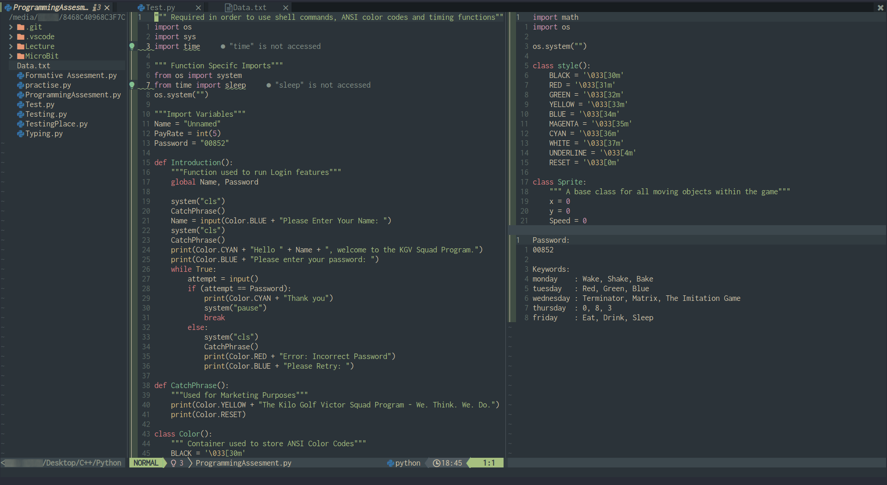
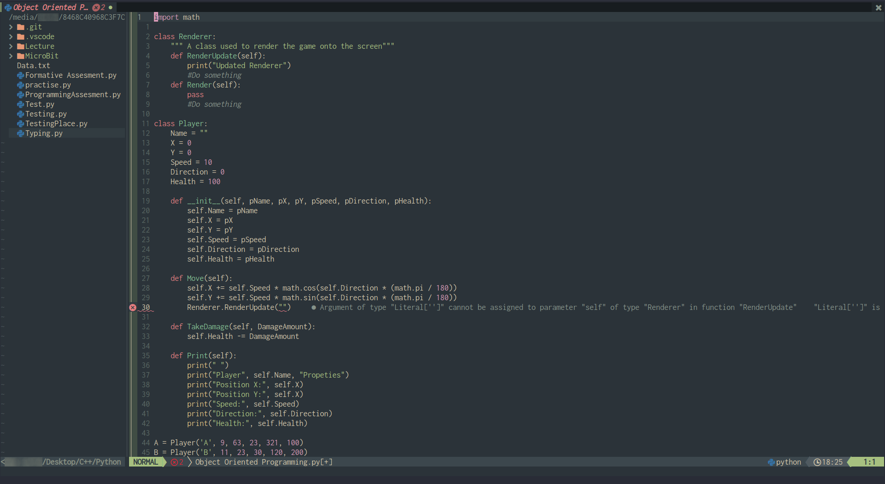
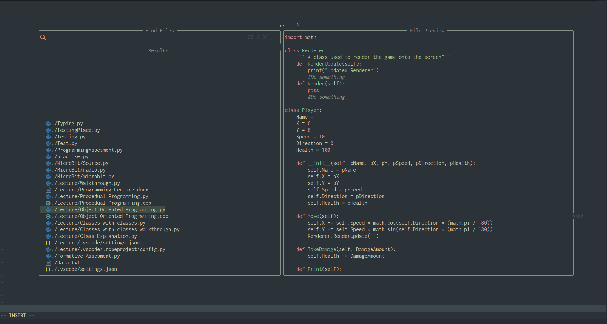

<h1 align="center"> 🌲 Forest.nvim</h1>

<p align="center">Forest.nvim is a fork of kyoto.nvim: A Fast ⚡, functional and beautiful Neovim configuration.</p>

### Credits
All credits go to samrath2007 for creating this awesome configuration. I simply modified it to suit my needs and prove that it is indeed easily customizable

Original Repository: [https://github.com/samrath2007/kyoto.nvim](url)

<a href="https://github.com/samrath2007/kyoto.nvim" Kyoto.nvim>

### Installation
Clone this repository to:
  - Linux - /home/"User Name"/.config/nvim
  - Windows - .../AppData/Local/nvim/
  
 Start Nvim and press enter to suppress the error messages.
  
 Install plugins using Packer:
 ```
  :lua require("pluginList")
  :PackerInstall
 ```
 Restart Nvim

## Features

- LSP Support (with Autocomplete)
- Ergonomic keybinds
- Blazing Fast File Explorer
- Really customizable (seriously, you should check it out)

## Screenshots






## Supported Languages

You can find a list of supported languages [here](https://github.com/kabouzeid/nvim-lspinstall/tree/main/lua/lspinstall/servers). To install any of them run

```
:LspInstall <language server name>
```
## Example
```
:LspInstall Python -- For Python
:LspInstall Cpp -- For C++
```

## Notable Plugins

- nvim-tree.lua
- lspsaga.nvim
- tokyonight.nvim
- everForest.nvim
- dashboard-nvim
- telescope.nvim
- nvim-bufferline.lua
- fugitive.vim
- lualine.nvim

